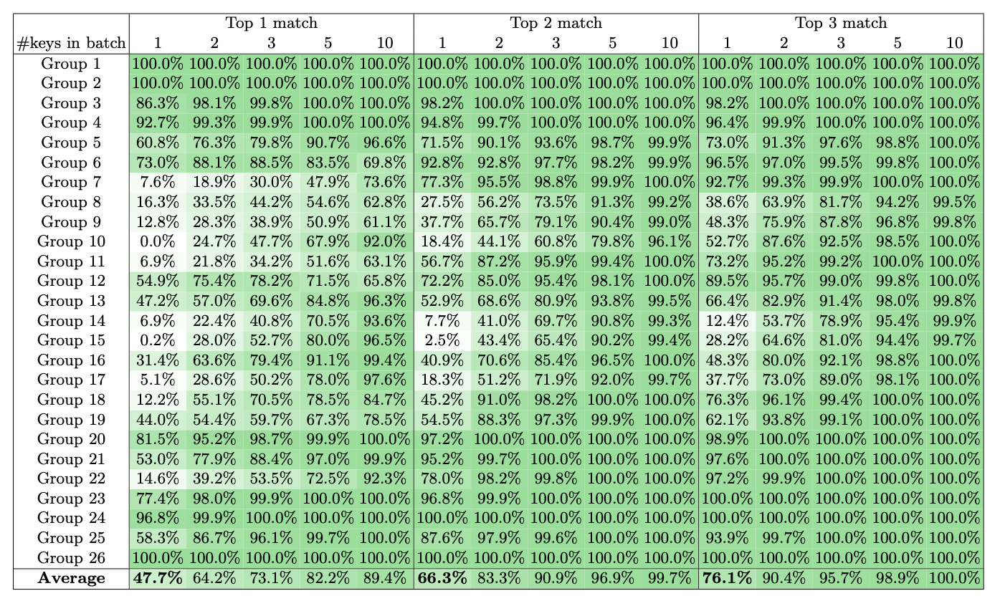

# Template for LaTeX table of model performance

This folder is related to process of visualising performance of the model. Such table can be produced using a dedicated task `visualize` in our tool.

This folder contains fractions of LaTeX table that was used to visualize the model performance. The table is being reconstructed from the outputs of the `evaluate` task of the model. An example of such table is provided below. 



### How to construct the model performance table

```bash
rsabias -a visualize -i /path/to/folder/with/results -o /path/to/where/you/want/the/table/stored
```
